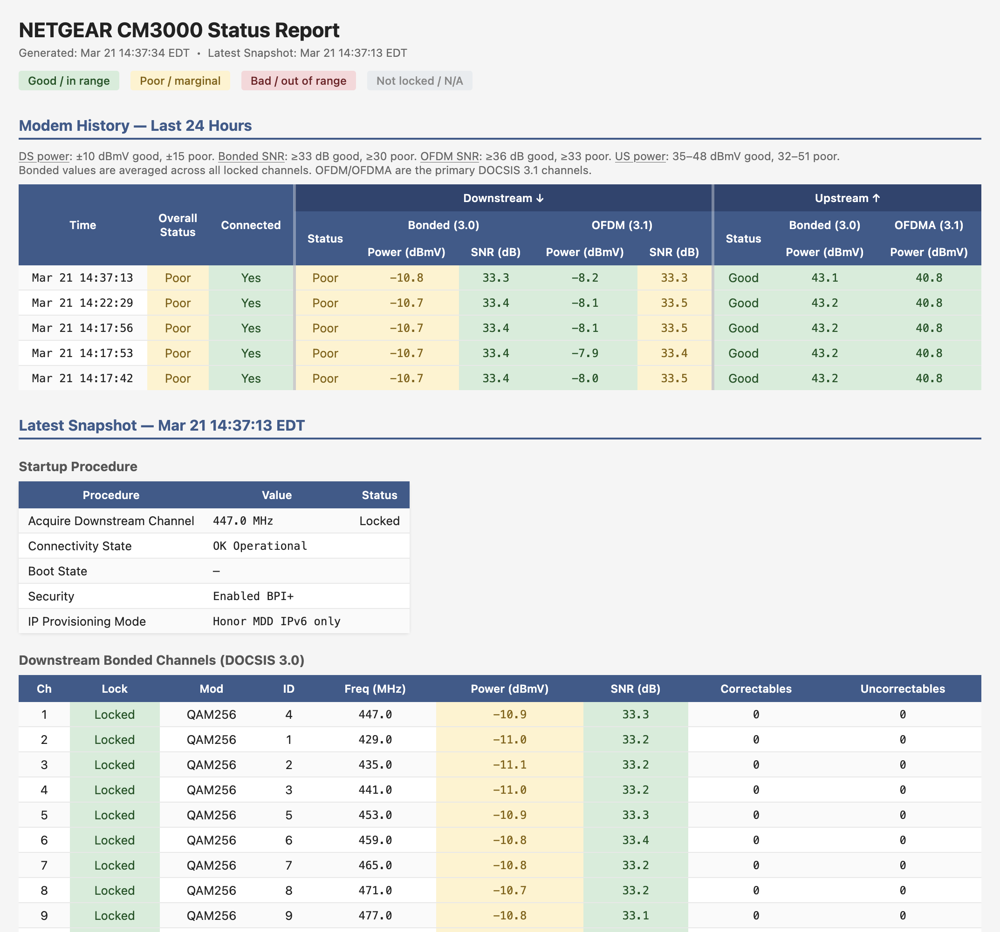

# NETGEAR CM3000 Stats

A lightweight Python tool to monitor a NETGEAR CM3000 cable modem. It logs
signal data over time to a local SQLite database and generates a
self-contained, color-coded HTML report:



## Features

- Logs in to the modem, downloads `CableInfo.txt`, and logs out
- Parses modem statistics and saves history in SQLite
- Archives raw `CableInfo.txt` files with timestamps
- Generates a self-contained HTML report with:
  - Modem history table with color-coded signal quality metrics
  - Additional channel details and event log from the latest snapshot

## Requirements

- Python 3.7+ (no third-party dependencies required!)
- A NETGEAR CM3000 modem (tested on firmware version V6.01.04)

## Quick Start

0. Save password to file:<br>
    ```bash
    echo 'YOUR_ADMIN_PASSWORD' > .cm3000_password
    chmod 600 .cm3000_password
    ```

1. Collect data from the modem:<br>
    ```bash
    python3 cm3000_fetch.py
    ```

2. Generate the HTML report:<br>
    ```bash
    python3 cm3000_report.py
    ```

3. Open `report.html` in your browser.

## Scripts

### `cm3000_fetch.py`

Logs in to the modem, downloads `CableInfo.txt`, saves a timestamped copy
to the archive directory, parses it, and adds the results to SQLite.

```
usage: cm3000_fetch.py [-h] [--url URL] [--password-file FILE] [--db DB] [--data-dir DATA_DIR]

options:
  --url URL              Base URL of the modem (default: https://192.168.100.1)
  --password-file FILE   File containing the admin password (default: .cm3000_password)
  --db DB                SQLite database path (default: cm3000.db)
  --data-dir DATA_DIR    Directory for raw .txt archives (default: data/)
```

### `cm3000_report.py`

Reads the SQLite database and generates a self-contained HTML report.

```
usage: cm3000_report.py [-h] [--db DB] [--hours HOURS] [-o OUTPUT]

options:
  --db DB              SQLite database path (default: cm3000.db)
  --hours HOURS        Hours of fetch history to show (default: 24)
  -o OUTPUT            Output file, or "-" for stdout (default: report.html)
```

## Automating with cron

Add a line like this to your crontab (`crontab -e`) to collect data
every hour and regenerate the report:

```
0 * * * * cd /path/to/netgear-cm3000-stats && python3 cm3000_fetch.py && python3 cm3000_report.py
```

## Files

| File / Directory | Description |
|---|---|
| `cm3000_fetch.py` | Fetch, parse, and store modem data |
| `cm3000_report.py` | Generate the HTML report |
| `.cm3000_password` | Admin password file *(gitignored, chmod 600 recommended)* |
| `cm3000.db` | SQLite database *(gitignored, created on first run)* |
| `data/` | Raw `CableInfo.txt` archives *(gitignored, created on first run)* |
| `report.html` | Generated report *(gitignored)* |

## Signal Quality Thresholds

| Metric | Good | Poor | Bad |
|---|---|---|---|
| DS Power (dBmV) | −10 to +10 | −15 to +15 | outside ±15 |
| Bonded SNR (dB) | ≥ 33 | ≥ 30 | < 30 |
| OFDM SNR/MER (dB) | ≥ 36 | ≥ 33 | < 33 |
| US Power (dBmV) | 35 - 48 | 32 - 51 | outside 32 - 51 |

OFDM/OFDMA are the primary DOCSIS 3.1 channels. Bonded channels
are DOCSIS 3.0 supplementary channels.

## License

MIT License; see [LICENSE](LICENSE) for details.

## AI Disclosure

This project was largely developed using
[Claude Code](https://claude.ai/claude-code) from Anthropic.
